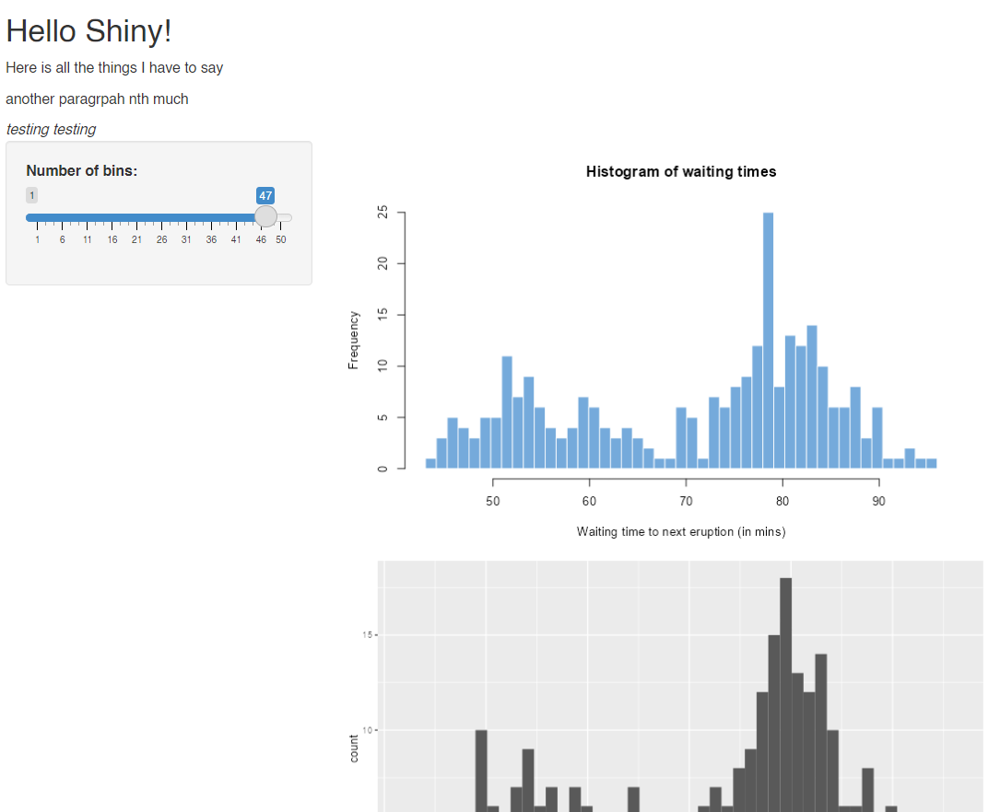
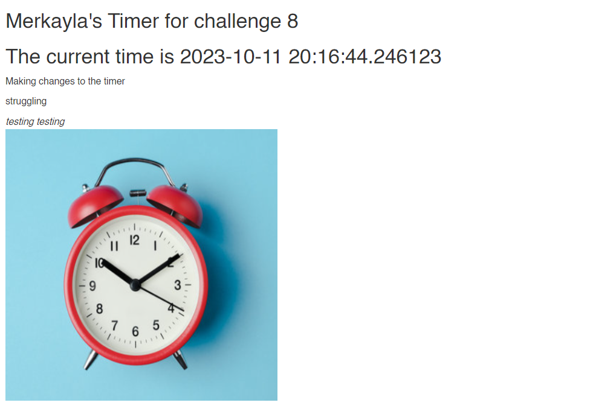

```{r setup, include=FALSE}
knitr::opts_chunk$set(echo = TRUE)
```


Note that the `echo = FALSE` parameter was added to the code chunk to prevent printing of the R code that generated the plot.

```{r, out.height= "350px",out.width= "800px",echo=FALSE,eval=TRUE,fig.cap="Codealong 8"}

```

```{r, out.height= "350px",out.width= "800px",echo=FALSE,eval=TRUE,fig.cap="Codealong 8"}

```
